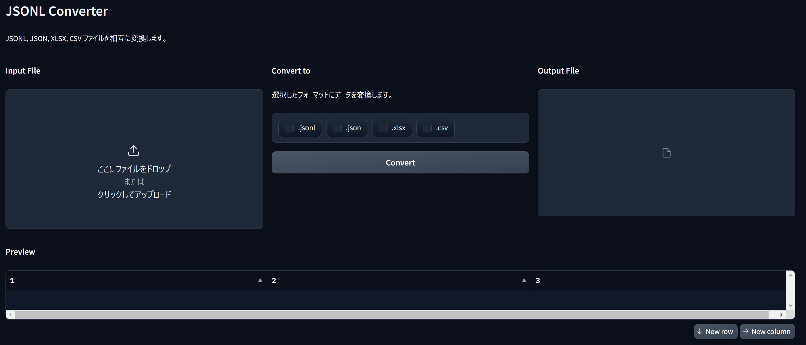
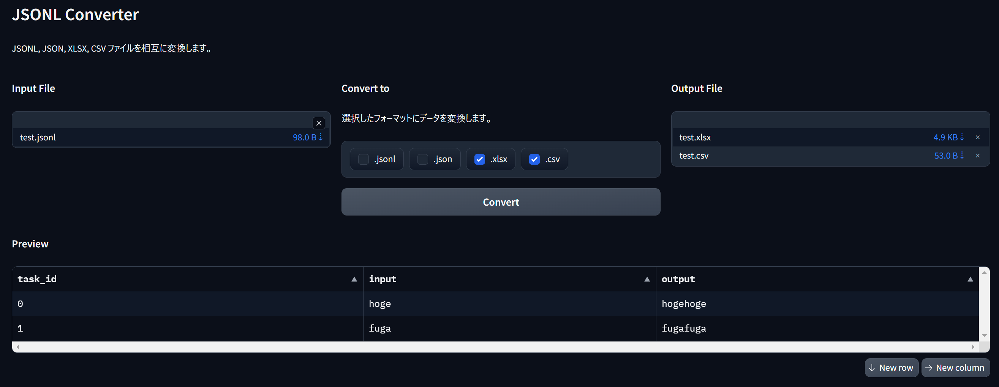

# JSONL Converter

jsonl, json, excel, csvファイルを相互変換できます。

## セットアップ
`pip install -r requirements.txt`で必要なライブラリをインストール

## 使い方
以下のコマンドでアプリケーションを起動します。

```
python jsonl_converter.py
```

起動後、以下の手順でファイルを変換できます。
1. `Input File`で変換したいファイルを選択します。
2. `Convert to`で変換後のフォーマットを選択します。
3. `Convert`ボタンをクリックします。
4. `Output File`に変換後のファイルが表示され、ダウンロード可能になります。

## 画面イメージ
### 起動時


### 読み込み・変換後


## サポートされているフォーマット
- JSONL (.jsonl)
- JSON (.json)
- Excel (.xlsx)
- CSV (.csv)